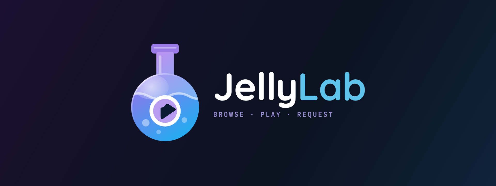

<p align="center">
  
</p>

Built with Expo Router (SDK 57), React Native 0.86, and TypeScript. iOS-first; Android builds but isn't polished.

## What it does

- **Library** — Apple TV-style layout: featured hero, Continue Watching row, one row per Jellyfin library. Header (page title + avatar) fades on scroll, status bar overlays the hero.
- **Item detail** — poster, backdrop, overview, cast, download-progress bars for in-flight Jellyseerr/Seerr requests. Series show a season/episode picker.
- **Player** — custom overlay. AVPlayer for compatible files, VLC fallback for MKV/DTS/anime/whatever AVPlayer refuses. Engine picker in settings.
  - Scrubbing, ±10s skip, speed control, PiP, fullscreen with rotation lock
  - Embedded + external subtitle picker with size and language preferences
  - Watch progress reported to Jellyfin (start/progress/stopped)
  - AirPlay button (native) + Chromecast (Google Cast SDK — uses the public default media receiver; register your own for custom branding)
- **Search** — Seerr (Jellyseerr fork) TMDB search + Discover categories (Trending / Popular Movies / Popular TV / Anime / Upcoming). Tap a card for TMDB detail. Admins can delete requests or remove media from Jellyfin (Radarr/Sonarr file wipe).
- **Requests** — pull-to-refresh with human-readable status + admin actions.
- **Downloads** — dedicated tab with empty state; offline playback is on the roadmap.
- **Profile** — Apple TV-style grouped list. Change display name, password, avatar (camera / library / remove). Preferences: subtitles, playback, language. Admin shortcuts to Jellyfin/Seerr dashboards when signed in as admin. Servers section for managing multiple homelab pairs.
- **Custom tab bar** — floating glass pill (Library / Requests / Downloads) + detached search circle that expands into an inline search bar (Apple TV pattern). Smooth Reanimated layout transitions between states.
- **Servers** — add/edit/delete/switch multiple Jellyfin+Jellyseerr pairs from Profile → App → Servers. Switching signs you out and re-prompts login for the new server. Server-edit screen has a "Test connection" button that pings both endpoints before you save. No server URLs baked in the app.
- **i18n** — English, Dutch, Turkish, German. Auto-detects device language; override in Profile → Language.

## Requirements

- Node.js 20+ and npm 10+
- macOS with Xcode 15+ for local iOS builds. Windows can use [EAS Build](https://docs.expo.dev/build/introduction/).
- Apple Developer account ($99/yr) for TestFlight distribution or long-lived on-device installs.
- A running Jellyfin server and a running [Seerr](https://github.com/seerr-team/seerr) (Jellyseerr fork, ships as `ghcr.io/seerr-team/seerr:latest`) or Jellyseerr instance with your Jellyfin account imported (Users → Import from Jellyfin).
- The device must resolve and reach the Jellyfin/Jellyseerr hostnames — LAN or mesh VPN (NetBird / Tailscale) with DNS routing pointing your internal domain at a local resolver.
- Chromecast (optional): the app ships with Google's public default media receiver so casting works out of the box. If you want a branded receiver or Cast-side custom features, register one in the [Cast Developer Console](https://cast.google.com/publish/) and set `iosReceiverAppId` in `app.json` locally (do not commit your ID).

## Configuration

Nothing server-specific is compiled into the app. On first launch you're prompted to add a server (name + Jellyfin URL + Jellyseerr URL). All server data is user-provided at runtime.

`config.ts` only holds client identity (name, version, device name string used in Jellyfin's session list).

## Security & storage

- **Server URLs** — entered by the user, stored in `expo-secure-store` (`servers_list`, `current_server_id`). Not embedded in the app or committed to the repo.
- **Passwords** — never stored. Sent once to Jellyfin's `/Users/AuthenticateByName` in exchange for an access token.
- **Access token** (Jellyfin) and **session cookie** (Jellyseerr) — stored in `expo-secure-store`. Cleared on sign-out, server switch, or server delete.
- **No API keys, secrets, or tokens are committed** anywhere in this repo. Grep it if you like.
- **Cast receiver** — `app.json` ships with Google's public default media receiver. Register your own in the [Cast Developer Console](https://cast.google.com/publish/) and override `iosReceiverAppId` locally if you want a branded receiver; don't commit your ID.
- **iOS ATS** — `NSAllowsArbitraryLoads` is on so the app works with plain-HTTP homelab servers. If you only ever connect to HTTPS servers with valid certs, tighten it in `app.json` before shipping.

## Setup

```bash
git clone <this-repo-url>
cd jellylab
npm install
```

## Running

Native modules (`expo-secure-store`, `expo-video`, `react-native-vlc-media-player`, `react-native-google-cast`, `expo-image-picker`, `expo-screen-orientation`) are **not compatible with Expo Go**. You need a development build.

### Local iOS build (macOS)

```bash
npx expo prebuild --platform ios --clean
npx expo run:ios --device
```

First prebuild is slow (~5 min) because VLCKit is ~50 MB. Rebuilds are fast unless native config changes.

### Cloud build (Windows)

```bash
npm install -g eas-cli
eas login
eas build --profile development --platform ios
```

Install the `.ipa` via TestFlight or Xcode → Devices.

### Development server

```bash
npm start
```

Open the app on the phone — it connects to Metro over the same wifi.

## Project structure

```
app/                    Expo Router routes (file-based)
  (tabs)/               Bottom tab screens (library, search, requests, downloads)
  (tabs)/_layout.tsx    Custom floating pill tab bar (Reanimated transitions)
  item/[id].tsx         Item detail + custom player (~1500 lines)
  tmdb/[id].tsx         Seerr/TMDB detail (search results)
  profile.tsx           Profile + preferences + admin + servers link
  servers.tsx           Server list + switch/edit/delete
  server-edit.tsx       Add/edit server form + connection test
  settings/             Subtitles, playback, content, language, password
  login.tsx             Auth (Jellyfin credentials, via Seerr for session)
  _layout.tsx           Root layout with auth + server guard (dismisses modals on nav)
api/                    Jellyfin + Seerr/Jellyseerr HTTP clients (read base URL from server store)
                        push.ts talks to the jellylab-push bridge on the homelab
components/             Themed UI primitives (TabHeader for scroll-fade page titles)
config.ts               Client identity only — server URLs come from the store
hooks/                  useAuth, useServer (both pub/sub for cross-screen refresh)
i18n/                   4 languages (en, nl, tr, de) + init
player/                 Codec-based engine selection + VTT parser
plugins/                Local Expo config plugins (strips the push entitlement)
store/                  auth.ts, servers.ts, prefs.ts, search.ts (expo-secure-store + in-memory pub/sub)
theme/                  Abyss design tokens (colors, spacing, type)
types/                  Shared TypeScript types
```

## Known limitations

- **Direct-play depends on your server.** If your Jellyfin host can't transcode, VLC fallback handles most codec issues but corrupt/exotic files can still fail with no auto-recovery.
- **No downloads / no offline mode.** Every play is a live stream.
- **Plain HTTP allowed by default.** `NSAllowsArbitraryLoads` is enabled in `app.json` because most homelabs run HTTP behind a reverse proxy on the LAN. If you only connect to HTTPS servers, tighten it.
- **iPhone-only layout.** iPad renders as a stretched iPhone.
- **No live TV / no music library** (Jellyfin has them, jellylab doesn't surface them).
- **Push notifications need a paid Apple Developer account.** Apple only issues
  the `aps-environment` entitlement to Developer Program members, and all iOS
  background push goes through APNS. On a free personal team `xcodebuild`
  refuses to build with it at all, so `plugins/withoutPushEntitlement.js`
  strips it. The app and its server-side bridge are finished — see below.

## Roadmap

Ordered by realistic priority — small wins first, bigger platform work later.

**Recently shipped**
- Library hero is a 5-item carousel drawn from what you're part-way through and what arrived recently, cross-fading, with a pinned backdrop that stretches on pull instead of leaving a gap
- Notifications screen wired to a self-hosted push bridge — complete but gated on the Apple entitlement above; the same events reach you through the ntfy app meanwhile
- Search your own Jellyfin library alongside Seerr/TMDB — owned titles surface first with Play, everything else falls under Request
- Max streaming quality setting: above the chosen ceiling the server transcodes to HLS, below it the file is direct played untouched
- Runtime server management (add / edit / delete / switch, no baked-in URLs, connection test)
- Custom Apple TV-style floating tab bar with search-bar transformation (Reanimated transitions)
- Downloads tab (empty state; wiring in progress)
- Shared TabHeader (scroll-fade page titles) on every tab
- Custom player overlay in Abyss style with per-engine glass controls
- Watch progress sync to Jellyfin
- Season / episode picker for TV
- Chromecast + AirPlay
- 4-language i18n (en / nl / tr / de)

**Next up (small, ships soon)**
1. Watch history screen (finished items, separate from Continue Watching)
2. Friendlier error surfaces when a server URL is unreachable (currently mostly axios raw)
3. Per-server saved credentials (skip re-login on switch — currently signs out)
4. Auto-select the quality ceiling on cellular (needs `expo-network`; today it's a manual setting)
5. Turn on push once there's a paid Apple account — delete `plugins/withoutPushEntitlement.js` from `app.json`, `prebuild --clean`, rebuild. No code changes

**Mid-term (medium effort, high value)**
5. Downloads / offline playback (needs codec-aware file cache + player fallback for local file:// URLs)
6. iPad-friendly split layout (sidebar + detail pane; adaptive from 768pt)
7. Home Screen Widget (Continue Watching)
8. Push notifications for request approval / media available (needs APNS + Seerr webhook bridge)

**Platform expansion (larger scope)**
9. Music library browsing + playback
10. Live TV (guide + tuner)
11. Android polish pass (tabs, navigation, Cast native integration, VLC parity)
12. tvOS build (Apple TV target — same Jellyfin API, different UI conventions)

## License

MIT, from the Expo template baseline. See [LICENSE](./LICENSE).
